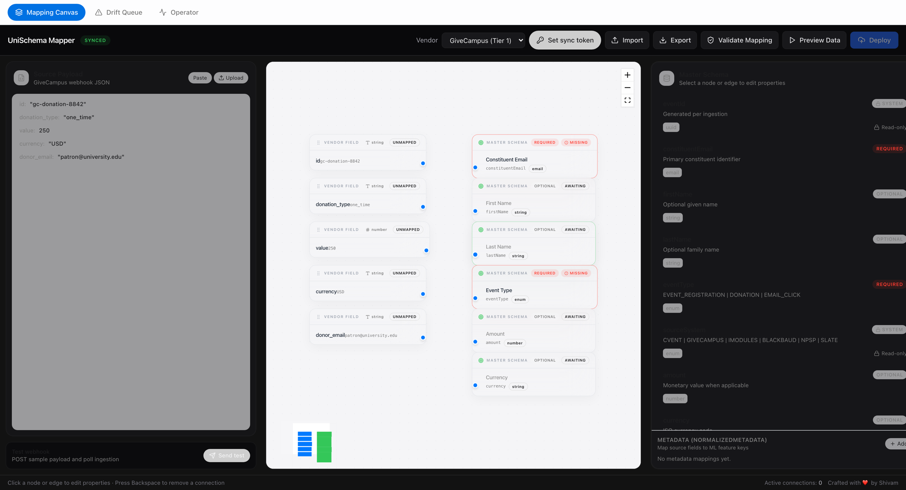
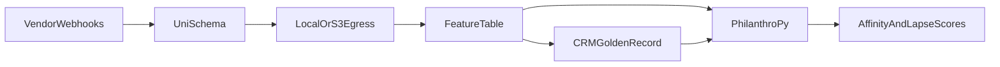

# UniSchema

[](https://github.com/PhilanthroPy-Project/UniSchema/actions/workflows/agent-validation.yml)
[](./LICENSE)
[](https://nodejs.org)

**v0.4.1** — Open-source webhook unification for university advancement & nonprofit fundraising teams.

UniSchema normalizes fragmented advancement webhooks into **ConstituentEvent**; [PhilanthroPy](https://github.com/PhilanthroPy-Project/PhilanthroPy) scores propensity, lapse, and engagement on the features you build from that stream.

> **Pilot-ready, not production-hardened.** Eight built-in vendors, SQLite or Postgres, self-hosted.  
> Read [docs/limitations-and-roadmap.md](./docs/limitations-and-roadmap.md) before production donor data.

**One URL:** API + admin UI on the same port.



<!-- Upgrade path: record a ~15s GIF of drawing mappings on the canvas (GitHub autoplays GIFs),
     save it as docs/assets/mapping-canvas.gif, and swap the .png above. -->


---

## Who this is for

- Advancement analytics teams ingesting **2–4 webhook vendors** (GiveCampus, Cvent, Slate, NPSP, etc.)
- Shops that want a **single normalized event stream** for warehouse, dashboards, or ML
- Teams comfortable **self-hosting** Node + secrets + S3 (or local egress for pilots)

## Who this is not for (today)

- Teams that need a **fully managed SaaS** with vendor SLAs — [hosted tier RFC](./docs/hosted-tier-rfc.md)
- **Full CRM sync** (bi-directional Slate/Salesforce) — UniSchema is webhook ingest + normalize, not a CRM
- **Fully no-code vendor onboarding** — new vendors require a one-time code deploy; see [canvas vs code](./docs/canvas-vs-code.md)
- Orgs whose canonical constituent model **differs significantly** from `ConstituentEvent` — use `normalizedMetadata` or fork via RFC

---

## Ecosystem



| Project | Role |
|---------|------|
| **UniSchema** (this repo) | Ingest webhooks → validate → map → egress `ConstituentEvent` |
| **[PhilanthroPy](https://github.com/PhilanthroPy-Project/PhilanthroPy)** | sklearn-native ML for advancement (RFM, propensity, lapse) |
| **dbt / Airflow** (optional) | Warehouse staging and orchestration — [downstream guide](./docs/downstream-pipeline.md) |

Full stack map → [docs/ecosystem.md](./docs/ecosystem.md)

---

## Quick start (~15 minutes)

**Requires:** [Docker](https://docs.docker.com/get-docker/) + Docker Compose, plus `curl` and `jq` for the demo scripts (`python3` for the downstream demo).

```bash
git clone https://github.com/PhilanthroPy-Project/UniSchema.git
cd UniSchema
docker compose up --build
```

1. Open [http://localhost:3000](http://localhost:3000) — mapping canvas + API together  
2. In another terminal: `bash scripts/demo-webhook.sh` (single webhook) or `bash scripts/demo-webhook.sh --multi` (all vendors)  
3. See **ConstituentEvent** JSON under `data/egress/`  
4. Prove downstream value: `bash scripts/downstream-demo.sh` (needs `python3`)

```
GiveCampus POST → 202 Accepted → background map → data/egress/.../eventId.json
```

<details>
<summary>Without Docker</summary>

```bash
npm install          # also installs the frontend workspace
npm run build
SERVE_FRONTEND=true npm start   # long-running — leave this in its own terminal
npm run demo:multi              # then run this in a second terminal
```

</details>

---

## Choose your guide

| I am… | Start here |
|-------|------------|
| **New adopter** — first webhook in ~15 min | [Quick start](#quick-start-15-minutes) above |
| **Admin / analyst** — drawing mapping lines on the canvas | [docs/admin-guide.md](./docs/admin-guide.md) |
| **Operator** — secrets, S3 egress, cloud deploy | [docs/operator-guide.md](./docs/operator-guide.md) |
| **Developer** — adding vendor #9 | [docs/adding-a-vendor.md](./docs/adding-a-vendor.md) |
| **Data engineer** — warehouse + dbt | [docs/downstream-pipeline.md](./docs/downstream-pipeline.md) |
| **Data scientist / ML engineer** — PhilanthroPy scoring | [docs/philanthropy-integration.md](./docs/philanthropy-integration.md) |
| **All docs** | [docs/README.md](docs/README.md) |

---

## Canvas vs code (what needs a deploy)

The visual mapper **overrides fields** on registered vendors — it does **not** create new webhook routes.

| Task | Canvas | Requires deploy |
|------|--------|-----------------|
| Remap fields → `normalizedMetadata` | Yes | No |
| Override built-in field wiring | Yes | No |
| New `POST /webhooks/{vendor}` route | No | Yes ([6-file checklist](./docs/adding-a-vendor.md)) |
| HMAC secret + Zod payload schema | No | Yes |

Details → [docs/canvas-vs-code.md](./docs/canvas-vs-code.md)

---

## Maturity (honest)

| Stage | Stack | Throughput (typical) | Guide |
|-------|-------|----------------------|-------|
| **Pilot** (~15 min) | Docker + SQLite + local egress | ~600–900 req/min (Docker, limit raised) | [Quick start](#quick-start-15-minutes) |
| **Production** | Fly/Railway + S3 + Postgres optional | ~120 req/min/IP default; tune for giving day | [Operator guide](./docs/operator-guide.md) |
| **Scale** | Postgres + Redis + multi-instance | Benchmark before peak — `npm run benchmark` | [Benchmarks](./docs/benchmarks.md) |

Vendor registry (8 built-in) → [docs/README.md#vendor-registry](docs/README.md#vendor-registry)

---

## What UniSchema is (and isn't)

| Today (v0.4.1) | Limits |
|----------------|--------|
| 8 vendors: GiveCampus, Cvent, iModules, Blackbaud, NPSP, Slate, Ellucian, CiviCRM | Tier 3 — verify with real payloads; [certification](./docs/vendor-certification.md) |
| Tier 1: GiveCampus, Cvent · Tier 2: iModules · Tier 3: Blackbaud, NPSP, Slate, Ellucian, CiviCRM | Ellucian + CiviCRM are bootstrap Tier 3 |
| SQLite default + optional Postgres | Horizontal scale needs Postgres + Redis |
| HMAC webhook verification | ~120 req/min/IP default |
| Visual canvas + metadata mappings | Opinionated master schema — [details](./docs/limitations-and-roadmap.md) |
| Local + S3 egress → PhilanthroPy ML bridge | ML requires optional `pip install -r examples/downstream/requirements-philanthropy.txt` |
| Drift queue + experimental LLM agent | **Human review required** — [ai-agent-loop](./docs/ai-agent-loop.md) |
| 3 event types: registration, donation, email click | New types via RFC — [schema-governance](./docs/schema-governance.md) |

---

## Downstream and ML

After `npm run downstream-demo`:

```bash
pip install -r examples/downstream/requirements-philanthropy.txt
python3 examples/downstream/philanthropy_crm_pipeline.py data/egress samples/crm-golden-record.csv
```

- **Integration guide:** [docs/philanthropy-integration.md](./docs/philanthropy-integration.md)
- **Notebook:** [examples/downstream/egress_report.ipynb](./examples/downstream/egress_report.ipynb)

---

## Research

UniSchema is the **data-normalization and provenance layer** beneath fundraising-analytics work. It turns heterogeneous advancement webhooks into a single, Zod-validated `ConstituentEvent` stream with deterministic event IDs — so feature tables and models are built on reproducible, auditable inputs instead of ad-hoc per-vendor scripts.

It operationally supports the analytics methods implemented in [PhilanthroPy](https://github.com/PhilanthroPy-Project/PhilanthroPy):

- **RFM segmentation** (recency / frequency / monetary) over normalized donation events
- **Donor propensity / major-gift likelihood** from engagement + giving features
- **Lapse / attrition modeling** on longitudinal constituent event streams

Run it yourself end-to-end with `npm run downstream-demo` (see [Downstream and ML](#downstream-and-ml) above).

### Citing UniSchema

If you use UniSchema in academic or applied fundraising-analytics work, please cite the release you used. A [`CITATION.cff`](./CITATION.cff) ships with the repo, so GitHub renders a **Cite this repository** button in the sidebar. A citable DOI is minted per tagged GitHub release once the repository is connected to [Zenodo](https://zenodo.org/); the DOI badge will land here with the first Zenodo-linked release.

---

## API (summary)

| Method | Path | Description |
|--------|------|-------------|
| `GET` | `/health` | Health check (version, egress, `driftPendingCount`) |
| `GET` | `/api/vendors` | Vendor registry with tier metadata |
| `POST` | `/webhooks/{vendor}` | Vendor webhooks (**202**) |
| `GET` | `/webhooks/ingestions/:id` | Poll async status (Bearer auth in production) |
| `POST` | `/api/mappings/sync` | Save canvas mapping (Bearer auth in production) |
| `POST` | `/api/mappings/preview` | Preview ConstituentEvent from artifact |
| `GET` | `/api/mappings/:vendor` | Load canvas mapping |
| `GET` | `/api/drift/events` | Schema drift queue |

Admin routes are also available without the `/api` prefix. Local dev works without tokens when `NODE_ENV` is not `production`.

Full operator reference → [docs/operator-guide.md](./docs/operator-guide.md).

---

## Project layout

```
UniSchema/
├── src/                    # Hono API — mappers, egress, drift
├── frontend/               # React mapping canvas
├── tests/                  # Vitest unit + integration
├── docs/                   # Role guides + PhilanthroPy integration
├── examples/downstream/    # Analytics, dbt, PhilanthroPy pipelines
├── deploy/                 # Fly.io, Railway, Terraform
├── samples/                # Demo webhook payloads
├── scripts/                # demo-webhook.sh, benchmarks
└── agents/                 # Experimental drift agent (Python)
```

---

## Testing

```bash
npm test                  # backend
npm run validate          # full CI parity (backend + frontend + build)
```

---

## Cloud deploy

[](https://fly.io/docs/languages-and-frameworks/docker/)
[](https://docs.railway.com/guides/dockerfiles)

Docker image: `ghcr.io/PhilanthroPy-Project/unischema:0.4.1`

| Platform | Docs |
|----------|------|
| Fly.io | [deploy/fly.toml](./deploy/fly.toml) + [deploy/README.md](./deploy/README.md) |
| Railway | [deploy/railway.toml](./deploy/railway.toml) |
| Any host | [Dockerfile](./Dockerfile) |

**Minimum production env vars** → [.env.example](./.env.example) and [operator guide](./docs/operator-guide.md).

---

## License

MIT
