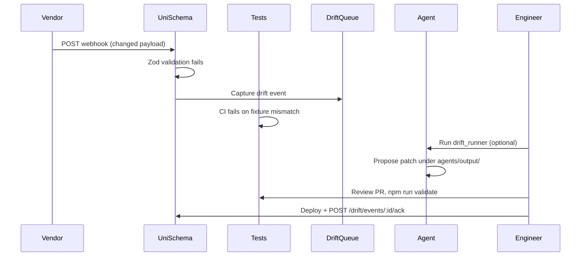

# AI agent loop

UniSchema is designed for **test-driven, human-reviewed** mapper maintenance — not autonomous production self-healing.

## Intended loop

## What is automated

| Step | Automated? |
|------|------------|
| Webhook accept + async ingest | Yes |
| Zod validation failure → drift queue | Yes |
| Vitest CI on every PR | Yes |
| LLM proposes mapper patch | Partial (experimental) |
| Auto-deploy to production | **No** |
| Auto-merge agent PRs | **No** |

## Components

| Component | Location | Role |
|-----------|----------|------|
| Vitest suite | `tests/unit/mappers.test.ts`, `tests/integration/webhooks.test.ts` | Contract boundary for mapper changes |
| Drift queue | `GET /api/drift/events`, SQLite/Postgres | Stores failed payloads + Zod errors |
| Drift agent | `agents/drift_runner/` | LLM proposes patches (experimental) |
| Drift worker | `scripts/drift-worker.ts` | Polls queue, optional local processing |
| Autogenerated fixtures | `tests/autogenerated/` | Agent-scaffolded tests — human review required |

## Operator workflow

1. Drift event appears after webhook validation failure (`GET /health` → `driftPendingCount`)
2. Engineer inspects drift payload in admin UI or API
3. Optionally run `python -m agents.drift_runner` locally
4. Review `agents/output/` proposal
5. Run `npm run validate`, adjust, open PR
6. After deploy: `POST /drift/events/:id/ack`

Full guide → [agents/README.md](../agents/README.md)

## Expectations for AI coding agents

When an autonomous coding agent updates mappers:

- **Must pass** `npm run validate` before merge
- **Must not** weaken Zod schemas to make tests pass without business justification
- **Must not** commit PII in fixtures — redact before `tests/__fixtures__/`
- **Should** add or update tests in `tests/unit/mappers.test.ts` for every mapper change

CI workflow: `.github/workflows/agent-validation.yml`

## What this is not

- Unattended production cron that hot-reloads mappers
- Guaranteed-correct LLM patches
- Replacement for vendor relationship management when APIs change

## Related

- [vendor-certification.md](./vendor-certification.md)
- [limitations-and-roadmap.md](./limitations-and-roadmap.md#drift-agent-is-experimental)
