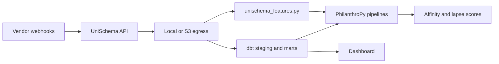

# Downstream pipeline guide

End-to-end path from UniSchema pilot to warehouse analytics and ML with [PhilanthroPy](https://github.com/PhilanthroPy-Project/PhilanthroPy).

## Architecture



## Pilot path (local, ~30 minutes)

```bash
docker compose -f docker-compose.pilot.yml up --build
npm run demo:multi
npm run downstream-demo
```

This runs:

1. Multi-vendor webhooks → ConstituentEvent JSON under `data/egress/`
2. `read_local_egress.py` — text report for stakeholders
3. `philanthropy_crm_pipeline.py` — PhilanthroPy scoring with CRM labels (when installed)
4. `crm_join_example.py` — join egress to [`samples/crm-golden-record.csv`](../samples/crm-golden-record.csv)

Optional PhilanthroPy install:

```bash
pip install -r examples/downstream/requirements-philanthropy.txt
```

Notebook: [`examples/downstream/egress_report.ipynb`](../examples/downstream/egress_report.ipynb)

## Production path (S3 → warehouse)

### 1. Configure S3 egress

See [operator-guide.md](./operator-guide.md). UniSchema writes NDJSON batches:

```
s3://{bucket}/{prefix}/batches/{YYYY}/{MM}/{DD}/{batchId}.ndjson
s3://{bucket}/{prefix}/batches/{YYYY}/{MM}/{DD}/{batchId}.manifest.json
```

### 2. Snowflake external table

Run DDL from [`examples/downstream/snowflake_external_table.sql`](../examples/downstream/snowflake_external_table.sql).

### 3. dbt transformation

```bash
cd examples/downstream/dbt
dbt deps   # if using packages
dbt run --profiles-dir .
```

Models:

| Model | Purpose |
|-------|---------|
| `stg_constituent_events` | camelCase → snake_case staging view |
| `mart_constituent_engagement_daily` | Daily per-email engagement rollup |
| `mart_constituent_rfm_features` | Per-constituent RFM features for PhilanthroPy |

Export `mart_constituent_rfm_features` to CSV or query from Python for batch scoring.

### 4. Airflow (optional)

[`examples/downstream/airflow_dag_stub.py`](../examples/downstream/airflow_dag_stub.py) loads NDJSON when triggered by UniSchema's `AIRFLOW_WEBHOOK_URL` POST (`egress.batch.ready` event).

## ML and CRM join

**Recommended:** [philanthropy-integration.md](./philanthropy-integration.md)

| Script | Status |
|--------|--------|
| `philanthropy_crm_pipeline.py` | **Primary** — CRM labels + `DonorPropensityModel` |
| `philanthropy_pipeline.py` | Egress-only demo with proxy labels |
| `unischema_features.py` | Feature table library |
| `crm_join_example.py` | CRM join (`externalConstituentId` or email) |

CRM join prefers `externalConstituentId` → CRM `constituent_id`, then email fallback.

## Next steps

- [Adoption checklist](./adoption-checklist.md) — week-by-week pilot → production
- [Benchmarks](./benchmarks.md) — load test before giving day
- [Postgres](./postgres.md) — when to move off SQLite
- [ecosystem.md](./ecosystem.md) — UniSchema + PhilanthroPy stack map
