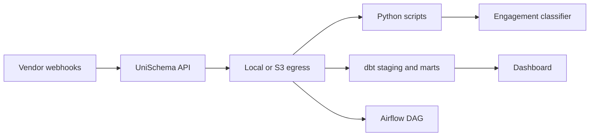

# Downstream pipeline guide

End-to-end path from UniSchema pilot to warehouse analytics and ML.

## Architecture



## Pilot path (local, ~30 minutes)

```bash
docker compose -f docker-compose.pilot.yml up --build
npm run demo
npm run downstream-demo
```

This runs:

1. GiveCampus webhook → ConstituentEvent JSON under `data/egress/`
2. `read_local_egress.py` — text report for stakeholders
3. `bot_engagement_classifier.py` — ML feature demo (synthetic labels)
4. `crm_join_example.py` — join egress to [`samples/crm-golden-record.csv`](../samples/crm-golden-record.csv)

Optional: open [`examples/downstream/egress_report.ipynb`](../examples/downstream/egress_report.ipynb) for charts.

Install Python deps: `pip install -r examples/downstream/requirements.txt`

## Production path (S3 → warehouse)

### 1. Configure S3 egress

See [operator-guide.md](./operator-guide.md). UniSchema writes NDJSON batches:

```
s3://{bucket}/{prefix}/batches/{YYYY}/{MM}/{DD}/{batchId}.ndjson
s3://{bucket}/{prefix}/batches/{YYYY}/{MM}/{DD}/{batchId}.manifest.json
```

### 2. Snowflake external table

Run DDL from [`examples/downstream/snowflake_external_table.sql`](../examples/downstream/snowflake_external_table.sql).

### 3. dbt transformation

```bash
cd examples/downstream/dbt
dbt deps   # if using packages
dbt run --profiles-dir .
```

Models:

| Model | Purpose |
|-------|---------|
| `stg_constituent_events` | camelCase → snake_case staging view |
| `mart_constituent_engagement_daily` | Daily per-email engagement rollup |

Configure `profiles.yml` to point at your Snowflake database/schema containing the external table.

### 4. Airflow (optional)

[`examples/downstream/airflow_dag_stub.py`](../examples/downstream/airflow_dag_stub.py) loads NDJSON when triggered by UniSchema's `AIRFLOW_WEBHOOK_URL` POST (`egress.batch.ready` event).

Alternatively, use S3 event notifications on `*.manifest.json`.

## ML and CRM join

- **Classifier:** [`bot_engagement_classifier.py`](../examples/downstream/bot_engagement_classifier.py) — uses event mix + `normalizedMetadata` key count. Replace synthetic labels with CRM `engagement_tier` from your golden record.
- **CRM join:** [`crm_join_example.py`](../examples/downstream/crm_join_example.py) — join on `constituentEmail`.

## Next steps

- [Adoption checklist](./adoption-checklist.md) — week-by-week pilot → production
- [Benchmarks](./benchmarks.md) — load test before giving day
- [Postgres](./postgres.md) — when to move off SQLite
