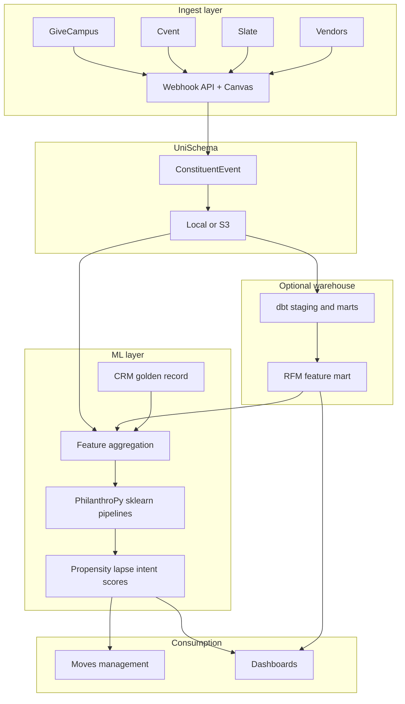

# PhilanthroPy-Project ecosystem

Open-source tooling for university advancement data teams — from webhook ingest to predictive scoring.

## Stack map

## Projects

| Project | Repository | Role |
|---------|------------|------|
| **UniSchema** | [PhilanthroPy-Project/UniSchema](https://github.com/PhilanthroPy-Project/UniSchema) | Webhook ingest, Zod validation, visual mapper, egress |
| **PhilanthroPy** | [PhilanthroPy-Project/PhilanthroPy](https://github.com/PhilanthroPy-Project/PhilanthroPy) | sklearn-native preprocessing and models for advancement ML |
| **Examples** | `examples/downstream/` in UniSchema | dbt, Airflow stub, PhilanthroPy bridge scripts |

## Typical adoption path

| Week | UniSchema | PhilanthroPy |
|------|-----------|--------------|
| 1 | Docker pilot, first webhook, egress report | Optional: run `philanthropy_crm_pipeline.py` on demo data |
| 2 | Wire production vendors, canvas metadata | Join CRM golden record for real labels |
| 3 | S3 egress + dbt staging | Batch scoring from `mart_constituent_rfm_features` |
| 4 | Production go/no-go | Portfolio integration (affinity scores to gift officers) |

See [adoption-checklist.md](./adoption-checklist.md).

## When to use which tool

| Need | Tool |
|------|------|
| Normalize GiveCampus + Cvent webhooks | UniSchema |
| Visual field mapping for analysts | UniSchema canvas |
| Major-gift propensity scoring | PhilanthroPy `MajorGiftClassifier` or `DonorPropensityModel` |
| Donor lapse risk | PhilanthroPy `LapsePredictor` |
| AMC grateful-patient features | PhilanthroPy `GratefulPatientFeaturizer` (EHR + CRM join) |
| Warehouse staging | dbt models in `examples/downstream/dbt/` |

## Integration contract

UniSchema owns **ConstituentEvent** schema versioning — [schema-governance.md](./schema-governance.md).

PhilanthroPy consumes **aggregated feature tables**, not raw vendor JSON. The bridge is documented in [philanthropy-integration.md](./philanthropy-integration.md).

## Related

- [competitive-positioning.md](./competitive-positioning.md) — vs generic ETL and iPaaS
- [limitations-and-roadmap.md](./limitations-and-roadmap.md) — honest v0.4 scope
